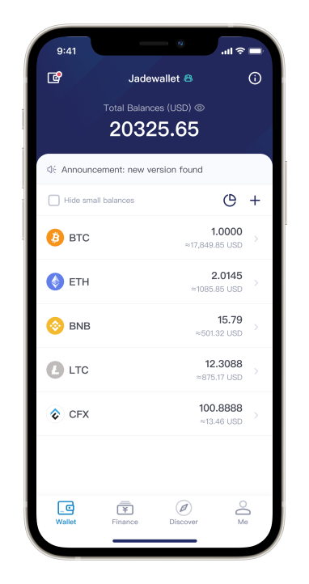

# Jadewallet

**Jadewallet** is a revolutionary self-custody solution that is built on foundation of the cutting-edge technologies including **MPC (multi-party computation)** and **TSS (threshold signature scheme)**. The feature of **MPC-based Threshold Signature** offers users the complete control over their digital assets and the ability to achieve multi-signature with keyless cryptographic security.

The main disadvantage of multisig is that different blockchains requires different implementations, though plenty of blockchains don't even support multisig. Instead, **TSS** is obviously a better choice as it is entirely based on cryptography. Therefore, supporting **TSS** on each blockchain is always possible in spite of the blockchain's own implementation and features. Furthermore, signers' privacy will be well protected as their information won't be visible in transaction. It also reduces cost and avoids smart contract related risks since signature will be generated through **MPC** instead of executing a smart contract on chain. 

### A Typical Flow Preview

For instance, Alice, Bob and Chris together create a 2-3 wallet to share assets management and they decide to make a transfer. First Alice initiates the transfer and then Bob and Chris both receive push notifications. Since their wallet requires two signatures, Alice must wait for one of her friends to join the signing session before moving to the next step. Assuming Bob joins the session first, Alice and Bob both signs the transaction by using **MPC** technology and then the transaction will be broadcast to blockchain.

## Team members

* Alex Xu

* BoHao Tang

* Daizong Zhang

* Kevin Li

* Hilbert Zhou

* Andy Yi

* Kristie Guo

* Steven Wu

## Team Website	
* https://www.nbltrust.com/#/en/team

## Legal Structure 
Tuolian (Shanghai) Co., Ltd.

## Team's experience
* Alex Xu: Co-Founder and CTO at NBLTrust for 4 years. Core developer in all three custody product teams. IT Consultant at IBM for 9 years. 
* BoHao Tang: Senior full-stack developer and architect at NBLTrust for 3 years. Software engineer at Ubisoft for 4 years. Has been indie game developer for 4 years.
* Daizong Zhang: Core back-end developer. 5+ years Golang back-end development. Currently focusing on the blockchain field.
* Kevin Li: 6 years of native mobile development experience. 3 years of React Native, Flutter Hybrid and front-end development experience. Graduated from Syracuse University.
* Hilbert Zhou: 2 years of ops experience on AIX, websphere and Power. 7+ years back-end service development experience including HFT, CTA and blockchain.
* Andy Yi: Product manager at NBLTrust for 3 years. 9 years of QA Manager experience, worked for General Electric, Hua Wei and Travelzen.com.
* Kristie Guo: Product manager at NBLTrust for 2+ years. 2+ years of software engineer experience at Lending Club in San Francisco. Graduated from Cornell University.
* Steven Wu: Product manager at NBLTrust for 3 years. 6+ years of product manager and 4+ years full stack development experience. An ex start-up co-founder.

Founded in 2017 and headquartered in Shanghai, China, Tuolian (Shanghai) Co., Ltd. is a high-tech company specializing in the field of digital asset custody.

To provide overall solutions and related technical services for digital asset custody, Tuolian owns secure custody softwares based on self-developed high-strength classical cryptographic algorithms. And the hot&cold wallet and the hardware wallet products meet the bank's security level requirements. 

Tuolian provides the full package of custody services for well-known institutions such as Math Wallet and HashQuark.

## Team Code Repos
* https://github.com/nbltrust

* https://github.com/alexxuyang

## Roadmap
### Milestone 1 

- MPC core:

  - Implement key generation for creating secret shares without trusted dealers (keygen).
  - Implement using the secret shares to generate a signature (signing).
  - Implement a local test server to relay messages between multi parties.
  - Implement a demo to show keygen and signing process.

- Wallet app:

  - Build app architecture and framework with Flutter: network layer, data model, encryption mechanism, etc.

- Server API:
  - Create a MPC wallet
    - The api needs params such as wallet name, threshold, number of members, UUIDs to identify a wallet in database. 
  - Join a MPC wallet.
    - Add members to a specific wallet.
  - Backup a MPC wallet
    - Users can upload encrypted secret shares to server. The decryption key is always in users' control.
  - Restore a MPC wallet
    - A user could apply for restoring his own secret share.
    - Other members in same wallet group need to approve the application.
    - The applicant can fetch his encrypted secret share only if all other members agree the application.
  - MPC P2P channel and session management
    - Implement the P2P channel to dispatch message between multi parties. 
    - Manage the session with exception handling, such as timeout, network error, etc.

### Milestone 2

- Wallet app

  - Make MPC core as a library which can be called by using Dart. 
  - Any user can create a MPC wallet and invite other members to join the wallet.
  - To activate a wallet, members need to do keygen process to generate secret shares on their mobile devices.

- Server API:
  - Implement transfer logic
    - It will generate a transaction order on server when a member apply for sending a transaction.
    - The order would be marked as failed if any member reject it.
    - Create a signing session when members are ready to sign. Connect users -> construct raw tx -> review tx -> sign tx.
    - Broadcast the signed transaction to blockchain.
  - Transaction history
    - Query transaction history for a specific wallet.
  - Push notification

### Milestone 3

- Users can sign transactions with MPC protocol
- Users can backup secret shares
  - The wallet app would reminder users to backup secret shares.
  - A random decryption key would be generated to encrypt a secret share.
  - Encrypted secret shares would be upload to server.
- Users can restore secret shares
  - If accidents occur like mobile phone lost, a user need to restore his secret share before accessing wallet.
  - The user need to make an restore application.
  - Until other members agree the application, the user has not the right to fetch his encrypted secret share.
  - After encrypted secret share fetched, the applicant could use the decryption key to decrypt it.

### Milestone 4

- Support WalletConnect protocol.
- DeFi access with security and better user experience
  - Parse raw data as readable transaction info.
  - Warn risk operations such as approving spend limit and calling unknown smart contracts.

## Future Plans
**Jadewallet** wants to be the portal of institutional investors into the blockchain world. We will integrate **Jadewallet** with numerous blockchains to meet the needs of  institutional investors. And we will provide MPC core as a sdk to developers and blockchain community.

### References

[1] [Secure multi-party computation](https://en.wikipedia.org/wiki/Secure_multi-party_computation)

[2] [Threshold Signatures Explained](https://academy.binance.com/security/threshold-signatures-explained)